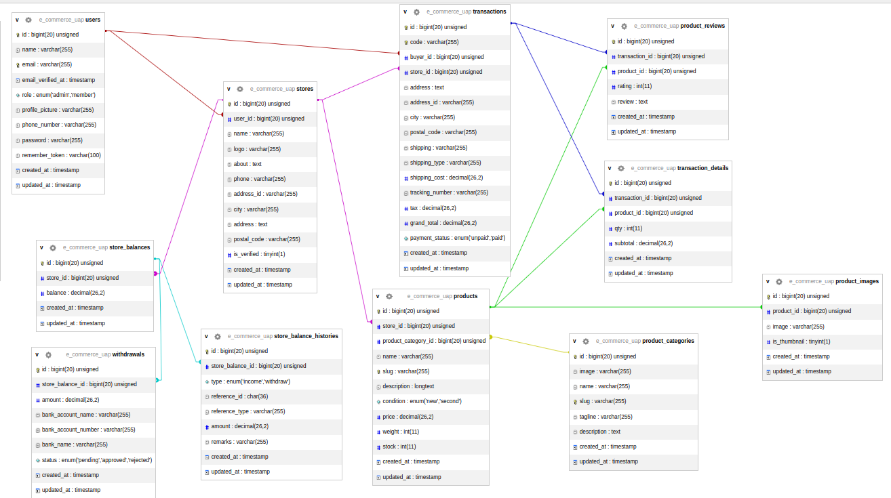

# **Ujian Praktikum Pemrograman Web Aplikasi E-Commerce (Laravel)**

# **Konteks Proyek**

Anda diberikan sebuah repositori proyek Laravel 12 yang sudah dilengkapi dengan:

1. _Starter Kit_ **Laravel Breeze** untuk basic autentikasi.
2. Semua _file_ **Migrations** yang diperlukan untuk membuat struktur database e-commerce (tabel users, products, transactions, stores, dll.).

**Tugas utama Anda** adalah membangun tampilan _full-stack_ E-Commerce yang fungsional (CRUD) berdasarkan skema _database_ yang disediakan, dengan implementasi khusus pada _Role Based Access Control_ (RBAC) dan _Flow_ Pembayaran.

---

# **Struktur Database**

## **Persyaratan Teknis & _Setup_ Awal**

1. **Framework:** Laravel 12\.
2. **Database:** Terapkan semua _file_ _migration_ yang telah disediakan (php artisan migrate).
3. **Seeder:** Anda **wajib** membuat _Database Seeder_ untuk membuat data awal, minimal:
    - Satu pengguna dengan role: 'admin'.
    - Dua pengguna dengan role: 'member'.
    - Satu Toko (stores) yang dimiliki oleh salah satu member.
    - Lima Kategori Produk (product_categories).
    - Sepuluh Produk (products) yang dijual oleh Toko tersebut.

---

## **Tantangan Khusus (_Challenge_)**

Implementasi Anda harus mencakup tiga tantangan inti berikut:

### **1\. Role Based Access Control (RBAC)**

Batasi akses ke halaman tertentu berdasarkan peran pengguna.

| Peran (users.role)  | Akses ke Halaman   | Aturan Akses                                                                |
| :------------------ | :----------------- | :-------------------------------------------------------------------------- |
| **Admin**           | Halaman Admin.     | Akses penuh ke menu admin.                                                  |
| **Seller/Penjual**  | Dasbor Penjual.    | Wajib memiliki role: 'member' **DAN** wajib memiliki entri di tabel stores. |
| **Member/Customer** | Halaman Pelanggan. | Akses ke halaman pembelian dan riwayat.                                     |

###

### **2\. Implementasi Sistem Keuangan (User Wallet & VA)**

Anda harus membuat **Tabel Baru** bernama **user_balances** (untuk _user wallet_/saldo) dan mengimplementasikan dua skema pembayaran:

| Skema Pembayaran                          | Flow Penggunaan                                                                                                                  |
| :---------------------------------------- | :------------------------------------------------------------------------------------------------------------------------------- |
| **Opsi A: Bayar dengan Saldo (_Wallet_)** | Pelanggan dapat _Topup_ Saldo terlebih dahulu (melalui VA). Saat _checkout_, saldo user_balances akan langsung dipotong.         |
| **Opsi B: Bayar Langsung (Transfer VA)**  | Saat _checkout_ produk, sistem akan membuat kode **Virtual Account (VA) yang unik** yang terkait langsung dengan transaction_id. |

###

### **3\. Halaman Pembayaran Terpusat (_Dedicated Payment Page_)**

Buat satu halaman/fitur untuk memproses konfirmasi pembayaran VA dari Opsi A (_Topup_) dan Opsi B (Pembelian Langsung).

-   **Flow:** Pengguna mengakses halaman Payment \-\> Masukkan Kode VA \-\> Sistem menampilkan detail (jumlah yang harus dibayar) \-\> Pengguna memasukkan nominal transfer (simulasi) \-\> Konfirmasi Pembayaran.
-   Jika sukses, sistem akan:
    -   **Untuk Topup:** Menambahkan saldo ke user_balances.
    -   **Untuk Pembelian:** Mengubah transactions.payment_status menjadi paid **dan** menambahkan dana ke store_balances penjual.

---

## **Fitur yang Harus Diimplementasikan (Berdasarkan Halaman)**

Implementasikan fungsionalitas CRUD untuk setiap peran:

### **I. Halaman Pengguna (Customer Side)**

| Halaman                              | Fungsionalitas Wajib                                                                                                                                                                            |
| :----------------------------------- | :---------------------------------------------------------------------------------------------------------------------------------------------------------------------------------------------- |
| **Homepage** (/)                     | Menampilkan daftar **semua produk** yang tersedia. **Filter** berdasarkan product_categories.                                                                                                   |
| **Halaman Produk** (/product/{slug}) | Menampilkan detail produk, semua product_images, nama store, product_reviews, dan tombol **"Beli"**.                                                                                            |
| **Checkout** (/checkout)             | Proses pengisian alamat, pemilihan _shipping_ (shipping_type, kalkulasi shipping_cost), pemilihan Opsi Pembayaran (Saldo / Transfer VA). Membuat entri di transactions dan transaction_details. |
| **Riwayat Transaksi** (/history)     | Melihat daftar transactions yang pernah dilakukan. Dapat melihat detail produk yang dibeli (transaction_details).                                                                               |
| **Topup Saldo** (/wallet/topup)      | Mengajukan _topup_ saldo pribadi. Menghasilkan VA unik.                                                                                                                                         |

###

### **II. Halaman Toko (Seller Dashboard)**

Halaman ini hanya dapat diakses oleh _Member_ yang sudah mendaftar sebagai Toko.

| Halaman                                     | Fungsionalitas Wajib                                                                              |
| :------------------------------------------ | :------------------------------------------------------------------------------------------------ |
| **Pendaftaran Toko** (/store/register)      | CRUD untuk membuat profil Toko (mengisi stores.name, logo, about, dll.).                          |
| **Manajemen Toko** (/seller/profile)        | CRUD untuk mengelola (update/delete) data Toko dan detail rekening bank.                          |
| **Manajemen Kategori** (/seller/categories) | **CRUD** untuk product_categories.                                                                |
| **Manajemen Produk** (/seller/products)     | **CRUD** untuk products dan product_images (termasuk penandaan is_thumbnail).                     |
| **Manajemen Pesanan** (/seller/orders)      | Melihat daftar pesanan masuk (transactions). Mengubah status pesanan dan mengisi tracking_number. |
| **Saldo Toko** (/seller/balance)            | Melihat saldo saat ini (store_balances.balance) dan riwayat saldo (store_balance_histories).      |
| **Penarikan Dana** (/seller/withdrawals)    | Mengajukan Penarikan dana (membuat entri di withdrawals) dan melihat riwayat withdrawals.         |

###

### **III. Halaman Admin (Admin Only)**

Halaman ini hanya dapat diakses oleh pengguna dengan role: 'admin'.

| Halaman                                   | Fungsionalitas Wajib                                                                                                                                              |
| :---------------------------------------- | :---------------------------------------------------------------------------------------------------------------------------------------------------------------- |
| **Verifikasi Toko** (/admin/verification) | Melihat daftar Toko yang belum terverifikasi (is_verified: false). Fitur untuk **Memverifikasi** atau **Menolak** pendaftaran toko (mengubah stores.is_verified). |
| **Manajemen User & Store** (/admin/users) | Melihat dan mengelola daftar semua users dan stores yang terdaftar.                                                                                               |

---

## **Penilaian**

Persentase nilai dilakukan berdasarkan indikator berikut

-   Tampilan 15%
-   presentasi 20% (jika nanti memungkinkan)
-   Penerapan MVC \+ Efisiensi code 15%
-   Kelengkapan Project sesuai kriteria 50%

Penilaian akan dilakukan berdasarkan commit nya. Semakin banyak dan kompleks yang dilakukan per individu dalam kelompok, bobot nilai yang diberikan akan semakin besar dan berlaku sebaliknya.

---

## **Informasi Tambahan**

1. Silahkan fork repositori ini, lalu mulai kerjakan di laptop masing masing dan jangan lupa invite partner kelompok ke dalam repositori.
2. Sertakan nama dan NIM anggota kelompok pada file [readme.md](http://readme.md)
3. Dipersilahkan membuat improvisasi pada codingan, library, dan sumber apapun yang dibutuhkan selama tidak merubah arsitektur aplikasi yang diberikan pada poin diatas.

---

**Ganbatte**

<iframe src="https://giphy.com/embed/ChX3hzy5CkXsI" width="480" height="245" style="" frameBorder="0" class="giphy-embed" allowFullScreen></iframe>
<a href="https://giphy.com/gifs/sad-studio-ghibli-ChX3hzy5CkXsI">via GIPHY</a>

